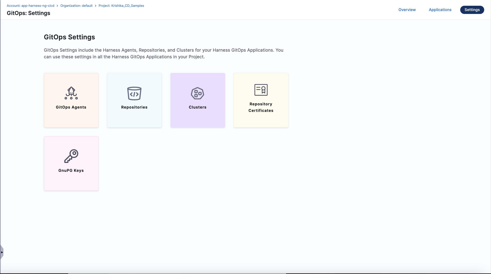
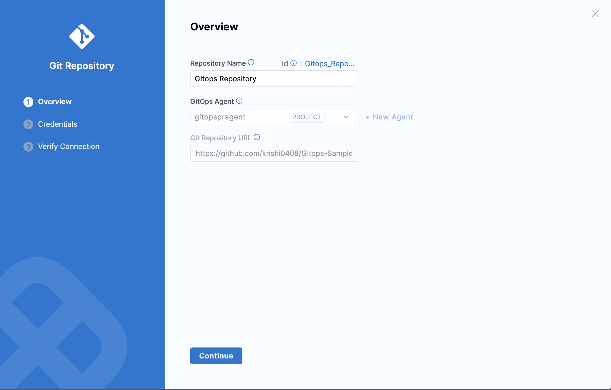
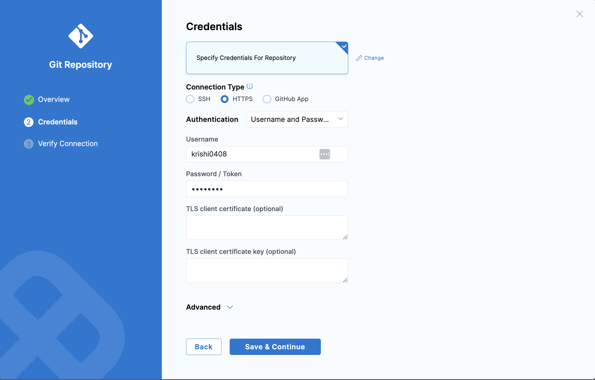
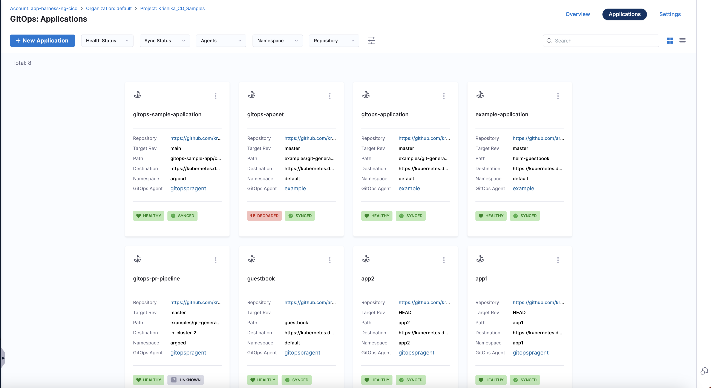
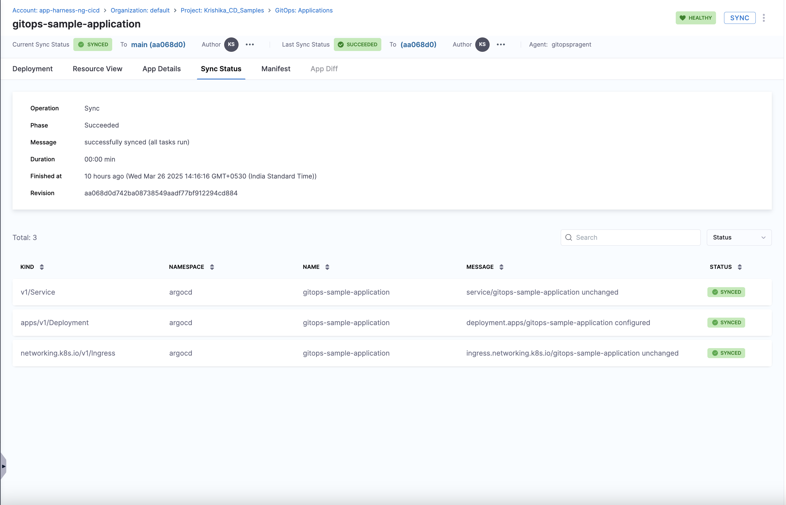
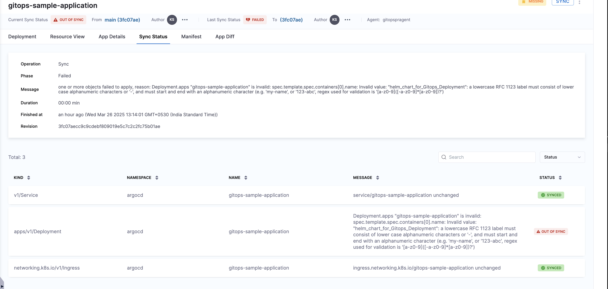
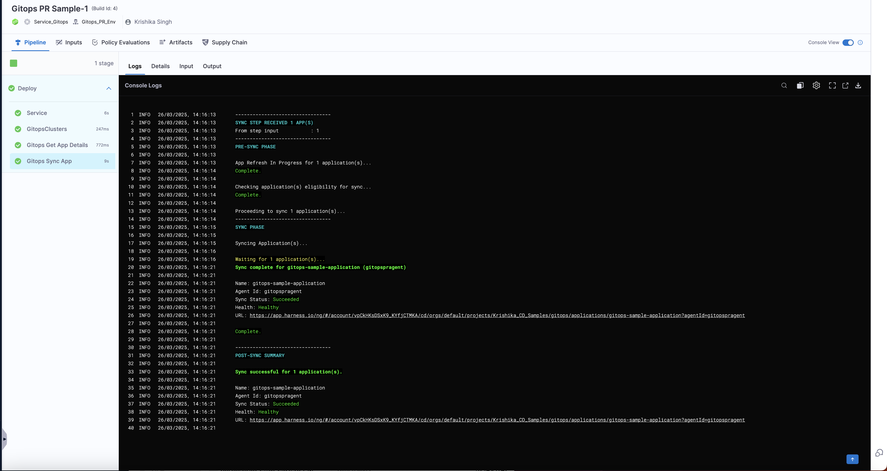

## Overview

This pipeline sample fetches application details and syncs the selected application using the Harness GitOps Pipeline.

## Prerequisites

Before using this pipeline, ensure the following prerequisites are met:

### 1. Install Harness GitOps Agent

A Harness GitOps Agent is a worker process that runs in your environment, makes secure outbound connections to Harness SaaS, and performs all the GitOps tasks you request in Harness.

Learn more about installing a [GitOps Agent](https://developer.harness.io/docs/continuous-delivery/gitops/connect-and-manage/install-a-harness-git-ops-agent/) in Harness.

### 2. Create a GitOps Cluster

A cluster is the target deployment cluster that is compared to the desired state. Clusters are synced with the source manifests you add as GitOps Repositories.

In this sample, we have used the credentials of a specific GitOps Agent we installed earlier for authentication. You can also authenticate by specifying the Kubernetes Cluster URL and credentials.

Learn more about creating a [GitOps Cluster](https://developer.harness.io/docs/continuous-delivery/gitops/get-started/harness-cd-git-ops-quickstart#step-3-add-a-harness-gitops-cluster) in Harness.

### 3. Create a GitOps Repository

A Harness GitOps Repository is a repo containing the declarative description of a desired state. The declarative description can be in Kubernetes manifests, Helm Charts, Kustomize manifests, etc.

Checkout the Interactive Guide to create Gitops Repository for this sample:

<iframe
    src="https://app.tango.us/app/embed/18d662e4-5c08-4d63-95a5-20ebac87b42e"
    title="Add a run step against a registered artifact in your CI pipeline."
    style={{ minHeight: '640px' }}
    width="100%"
    height="100%"
    referrerpolicy="strict-origin-when-cross-origin"
    frameborder="0"
    webkitallowfullscreen="true"
    mozallowfullscreen="true"
    allowfullscreen="true">
</iframe>

- Fork and clone this [Git repository](https://github.com/harness-community/Gitops-Samples).
- Navigate to **GitOps: Settings**  
  

- In **Overview**, select the GitOps Agent you created in Step 1 and provide the Git Repository URL.  
  

- In **Credentials**, specify the **Connection Type**, and select the **Authentication method**.  
  

- In the next step, **Verify the Connection**.

Learn more about creating a [GitOps Repository](https://developer.harness.io/docs/continuous-delivery/gitops/get-started/harness-git-ops-basics#repository) in Harness.

### 4. Create a GitOps Application

GitOps Applications manage GitOps operations for a given desired state and its live instantiation.

A GitOps Application collects the Repository (what you want to deploy), Cluster (where you want to deploy), and Agent (how you want to deploy). You define these entities and then select them when setting up your Application.

Checkout the Interactive Guide to create Gitops Application for this sample:

<iframe
    src="https://app.tango.us/app/embed/18d662e4-5c08-4d63-95a5-20ebac87b42e"
    title="Add a run step against a registered artifact in your CI pipeline."
    style={{ minHeight: '640px' }}
    width="100%"
    height="100%"
    referrerpolicy="strict-origin-when-cross-origin"
    frameborder="0"
    webkitallowfullscreen="true"
    mozallowfullscreen="true"
    allowfullscreen="true">
</iframe>

- Navigate to **Applications**  
  

- Click on **+ New Application**.
- In **Overview**, enter the **Application Name**, select your **GitOps Operator** (in this sample, we are using **ArgoCD**), and select the **GitOps Agent** you created in Step 1.

- In **Service**, click on **+ New Service**.  
  - Enter **Service Name**.  
  - Under **How do you want to set up your service?**, select **Inline** if you want to store your service in Harness or **Remote** if you want to store your service in a Git Repository.  
  - Under **Service Definition**, select the deployment type as **Kubernetes** and choose **GitOps**.  
  - Under **Manifest**, click on **+ Add Release Repo Manifest**.  
    - Select **Release Repo Store** as **GitHub**.  
    - Provide the GitHub Connector to authenticate with the repo containing your release repo manifest. Learn more about creating a [GitHub Connector](https://developer.harness.io/docs/platform/connectors/code-repositories/ref-source-repo-provider/git-hub-connector-settings-reference/). For this sample, we are using the same [GitOps Sample](https://github.com/harness-community/Gitops-Samples) repo.  
    - In **Manifest Details**, provide **Manifest Name**, set **Git Fetch Type** as **Latest from Branch**, select Branch **main**, and specify File Path as **gitops-sample-app/charts/Python-App/Chart.yaml**.  
  - Under **Artifacts**, click on **+ Add Artifact Source**.  
    - Select **Docker Registry** under **Specify Artifact Repository Type** and choose **Docker Registry Connector**. Learn more about creating a [Docker Connector](https://developer.harness.io/docs/platform/connectors/cloud-providers/ref-cloud-providers/docker-registry-connector-settings-reference) in Harness.  
    - Under **Artifact Details**, provide **Artifact Source Identifier**, enter the **Image Path** (for this sample, we are using a public image **krishi0408/python-helm-native-canary-blue**), specify a tag (for this sample, we use **9**), and click **Submit**.  
  - Click **Save**.  
- In **Environment**, click on **+ New Environment**.  
  - Enter **Name**.  
  - Choose **Environment Type**.  
  - Under **How do you want to set up your Environment?**, select **Inline** if you want to store your Environment in Harness or **Remote** if you want to store your Environment in a Git Repository.  
  - Click **Save**.  
- Under **Sync Policy**, select **Manual** and click **Continue**.  
- Under **Source**, select **Repo URL**, and provide the Repo URL (for this sample, we are using [GitOps Sample](https://github.com/harness-community/Gitops-Samples) repo).  
  - Under **Target Revision**, choose **Branch** and set it to **main**.  
  - Under **Path**, enter **gitops-sample-app/charts/Python-App**.  
  - Under **Helm**, choose the Values file as **values.yaml**.  
- Under **Destination**, choose the **GitOps Cluster** you created in Step 2 and provide the **Namespace** where you installed your **GitOps Agent**.  
- Click **Finish**.  

Learn more about creating a [GitOps Application](https://developer.harness.io/docs/continuous-delivery/gitops/get-started/harness-git-ops-basics#application) in Harness.

### Syncing Your Application  

#### Option 1: Manual Sync  

1. Under **GitOps**, go to **Applications** and select the GitOps application created in Step 4.  
2. Click **Sync**.  
     
3. Under **Synchronize Resources**, select all resources for service, deployment, and ingress.  
     
4. Click **Synchronize**.  

You can view **Recent Deployment Activities** under the Deployment Tab.  
  

Under **Resource View**, you can see the hierarchical structure of the GitOps-managed application.  
  

Under **Sync Status**, you can view the sync status of all resources.  
  

If your sync status fails, view the error under **Sync Status**, make changes to your resource file, and sync again.  
  

#### Option 2: Using a Harness Pipeline  

Checkout the Interactive Guide to Sync Gitops Application using a Harness Pipeline for this sample:

<iframe
    src="https://app.tango.us/app/embed/18d662e4-5c08-4d63-95a5-20ebac87b42e"
    title="Add a run step against a registered artifact in your CI pipeline."
    style={{ minHeight: '640px' }}
    width="100%"
    height="100%"
    referrerpolicy="strict-origin-when-cross-origin"
    frameborder="0"
    webkitallowfullscreen="true"
    mozallowfullscreen="true"
    allowfullscreen="true">
</iframe>

1. Under **Pipelines**, click **+ Create a Pipeline**, enter a name, and select **Inline** or **Remote** storage.  
2. Click **Add Stage**, select **Deploy**, and configure:  
   - **Deployment Type**: Kubernetes  
   - **GitOps Service**: Select the service created in Step 4.  
   - **Environment**: Select the environment created in Step 4.  
3. Under **Execution**, remove unnecessary steps and add:  
   - **GitOps Get App Details** step.  
   - **GitOps Sync** step.  
4. Click **Save** and **Run**.  

You can also view the whole pipeline yaml for Fetching App Details and Syncing Gitops App [here](/Sample-1/pipeline.yaml).

In the Execution, in console logs for step getting Gitops Get App Details you can see the details of the gitops application. 

In the Execution, in console logs for step Syncing Gitops App Details you can see the details of the gitops application. 

You have successfully fetched your first GitOps Application! 🚀